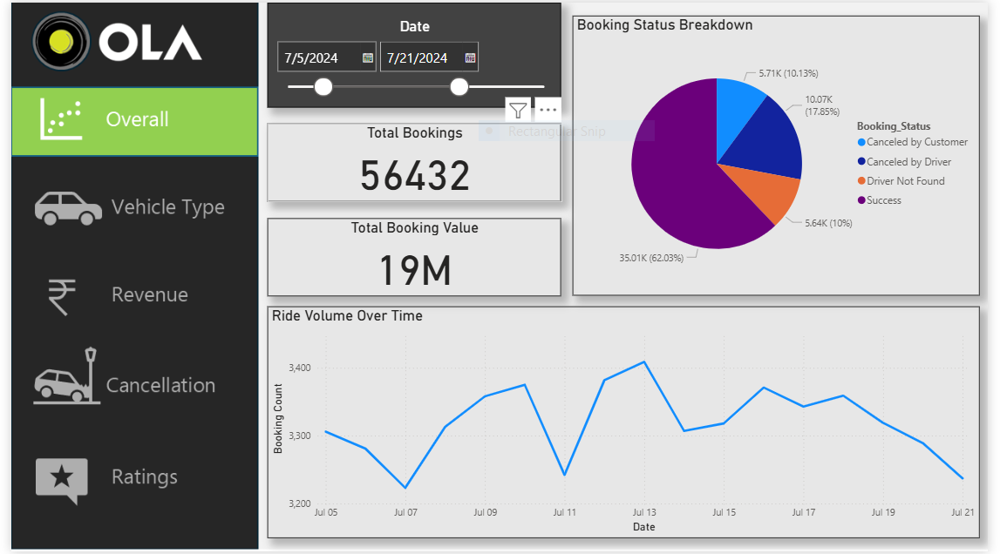
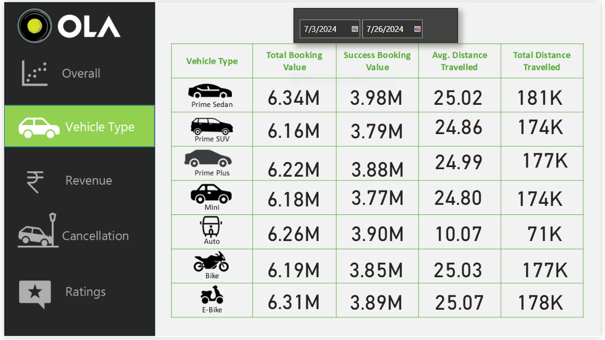
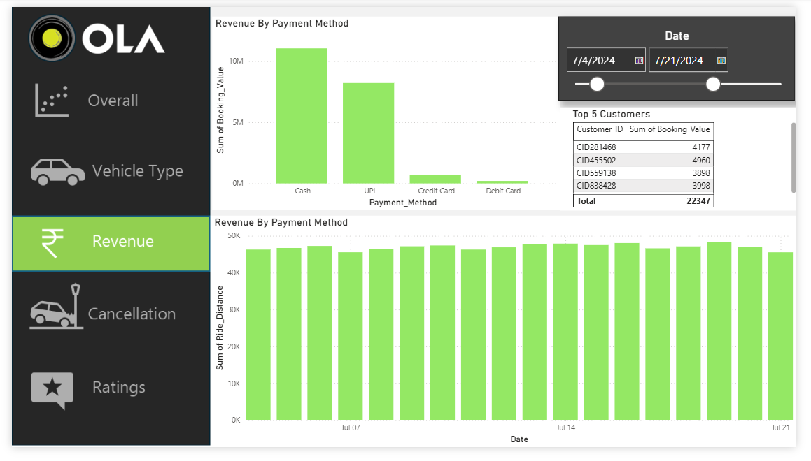
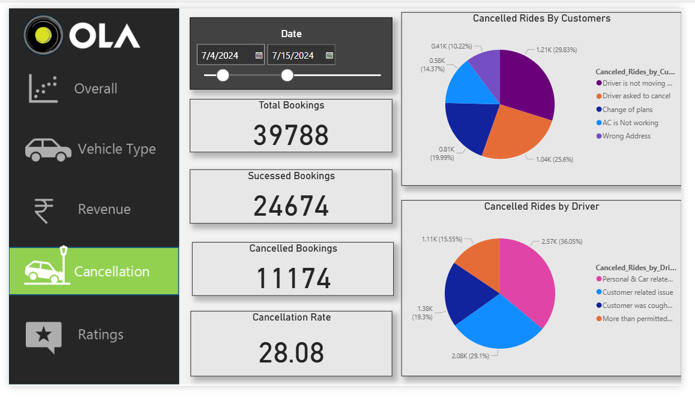
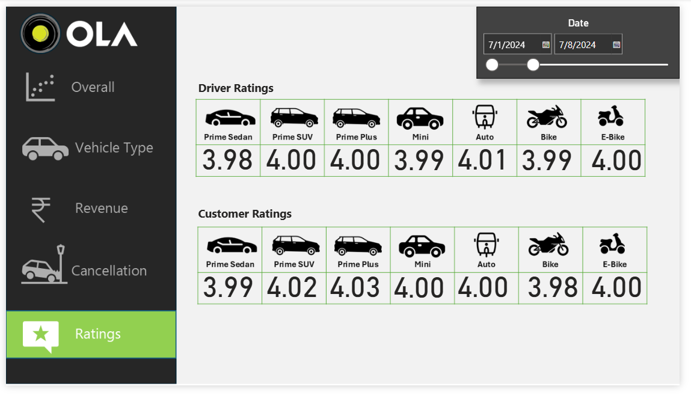

# 🚖 Ola BI Dashboard 

## 📌 Overview

The **Ola BI Dashboard** is an interactive Power BI project that analyzes Ola ride booking data to provide insights into bookings, revenue, cancellations, vehicle performance, and customer & driver ratings.

## 🛠️ Tech Stack

- Power BI Desktop
- Power Query
- DAX (Data Analysis Expressions)
- Data Modeling
- Microsoft Excel

## ✨ Features

- Interactive multi-page dashboard
- Booking and revenue analysis
- Vehicle-wise performance analysis
- Cancellation insights
- Customer & driver ratings
- Dynamic date filtering

## 📊 Dashboard Pages

- Overall Dashboard
- Vehicle Type Analysis
- Revenue Analysis
- Cancellation Analysis
- Ratings Dashboard

## 📈 Key Metrics

- Total Bookings
- Total Revenue
- Booking Success Rate
- Cancellation Rate
- Average Ride Distance
- Customer Ratings
- Driver Ratings

## 🎯 Skills Demonstrated

- Data Cleaning
- Data Modeling
- DAX
- Business Intelligence
- Dashboard Design
- Data Visualization

⭐ If you found this project useful, don't forget to give it a **Star** on GitHub!

## 📸 Dashboard Preview

### Overall Dashboard

### Vehicle Type Dashboard

### Revenue Dashboard

### Cancellation Dashboard

### Ratings Dashboard

